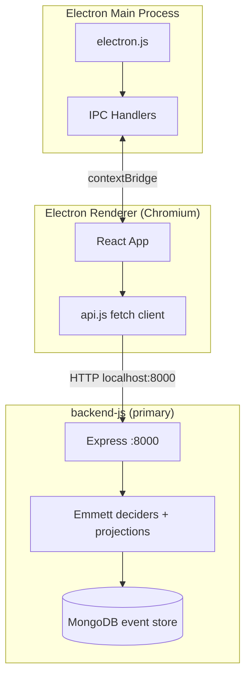
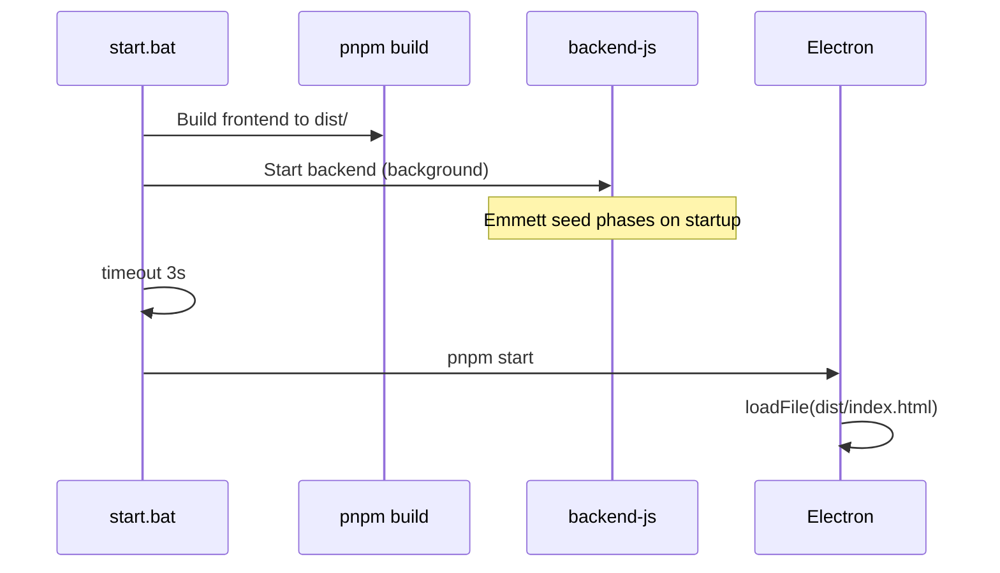
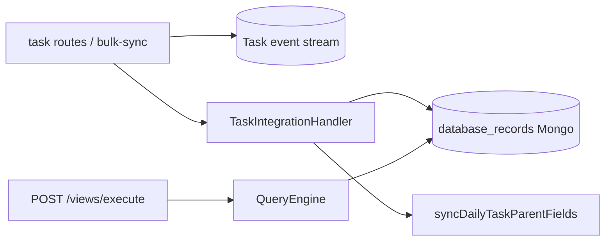

# InTheFlow — Architecture

> **Type**: Reference (live code truth)  
> **Router**: [_InTheFlowAppRouter.md](_InTheFlowAppRouter.md)  
> **Last Updated**: 2026-05-25

## System Overview

InTheFlow is a **dual-process desktop application** (Electron renderer + separate API server). The backend is **backend-js** (Express + Emmett event sourcing + MongoDB). Source: [`backend-js/`](../../backend-js/).

| Layer | Technology | Entry point |
| ----- | ---------- | ----------- |
| Desktop shell | Electron 27 | `frontend/electron.js` |
| UI | React 18 + Vite 5 | `frontend/src/main.jsx` |
| API (primary) | Express + Emmett | `backend-js/src/index.ts` |
| Persistence (primary) | MongoDB event store | `intheflow_dev` / `intheflow_test` |

## Startup Lifecycle

### Production path (`start.bat`)

### Development path

When `NODE_ENV=development`:

- Electron loads `http://localhost:5173` (Vite dev server)
- Backend is **not** spawned by Electron — start `backend-js` (`pnpm dev`) or via `start.bat` manually
- DevTools open automatically

In production mode, `electron.js` may spawn a **Vite preview** subprocess on `:4173` only — never the API backend.

## IPC Bridge

Electron uses **context isolation** with a preload script.

| File | Role |
| ---- | ---- |
| `frontend/preload.js` | Exposes `window.electronAPI` via `contextBridge` |
| `frontend/electron.js` | Registers `ipcMain.handle` handlers |

### Exposed APIs

| Method | IPC channel | Purpose |
| ------ | ----------- | ------- |
| `electronAPI.openDirectory()` | `dialog:openDirectory` | Native folder picker (Settings planning path) |
| `electronAPI.setBackgroundColor(hex)` | `set-background-color` | Sync Electron window background with theme |

### Backend spawn

**Electron does not spawn the API backend.** `electron.js` only manages the BrowserWindow and optional Vite preview server. Start the backend separately:

- **Default (`start.bat`)**: `backend-js` (`pnpm dev`) on `:8000`, then Electron

## HTTP Client (`api.js`)

All frontend data access goes through `frontend/src/api.js`:

- **Base URL**: `http://localhost:8000/api`
- **Transport**: `fetch` with JSON bodies
- **Error handling**: Parses `detail` from error responses (FastAPI-compatible format)

Namespaces: `tasks`, `dailyTasks`, `projects`, `settings`, `ai`, `views`.

See [03-Backend-API.md](03-Backend-API.md) for endpoint mapping.

## Navigation Model

InTheFlow uses **string-based view routing** — no React Router. `App.jsx` holds `currentView` state.

### Static views

| `currentView` value | Component |
| ------------------- | --------- |
| `dashboard` | `Dashboard.jsx` |
| `ai-hub` | `AiHub.jsx` |
| `calendar` | `Calendar.jsx` |
| `settings` | `Settings.jsx` |

### Dynamic views

| `currentView` value | Component | Determined by |
| ------------------- | --------- | ------------- |
| UUID string | `KanbanBoard.jsx` or `Backlog.jsx` | `DatabaseView.layout_type` |

When `currentView` is a view UUID:

1. `api.views.get(id)` — view metadata + database properties
2. `api.views.execute(id)` — query engine result (filtered/grouped records)

### Data refresh strategy

`refreshData()` runs on every `currentView` change:

| View type | Tasks fetched? | Notes |
| --------- | -------------- | ----- |
| dashboard, ai-hub, settings | Yes (`api.tasks.list()`) | Full task list |
| calendar | No | Calendar fetches daily tasks locally |
| dynamic view | Yes + execute | `api.views.execute()` + `api.tasks.list()` for drag-drop |

### Cross-view orchestration state

| State | Purpose |
| ----- | ------- |
| `dailyTasksVersion` | Counter; increment triggers Calendar refetch |
| `calendarAnchorDate` | ISO date string; Calendar opens week containing this date |
| `groupingColors` | Resolved map from settings |
| `theme` | `light` or `dark` |

## EAV Dual-Write Pattern

Tasks are the source of truth in event streams; Kanban/views read **EAV `database_records`**.

**backend-js (primary):**

Kanban/Backlog dynamic views read EAV via `QueryEngine`, not directly from task projections. After a Mongo wipe, run the EAV backfill (see `backend-js/scripts/backfill-task-records.ts`).

## CORS

Express allows all origins (`cors({ origin: "*" })`) for Electron dev server compatibility. Production should restrict to localhost.

## Key Source Paths

| Concern | Path |
| ------- | ---- |
| App root state | `frontend/src/App.jsx` |
| API client | `frontend/src/api.js` |
| Query engine | `backend-js/src/views/queryEngine/QueryEngine.ts` |
| Task integration handler | `backend-js/src/task/integration/TaskIntegrationHandler.ts` |
| Electron main | `frontend/electron.js` |
| Theme boot | `frontend/index.html`, `frontend/src/utils/theme.js` |
