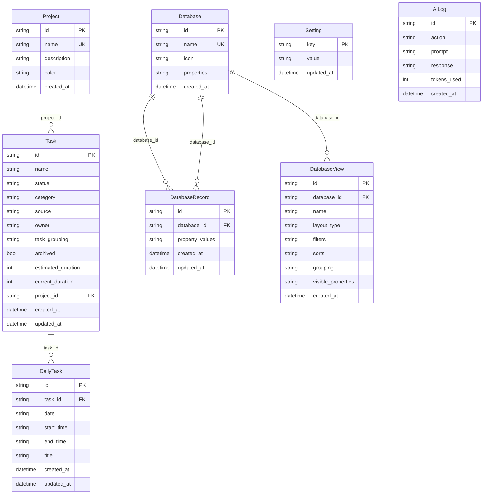

# InTheFlow — Database Schema

> **Type**: Reference (live code truth)  
> **Source**: `backend/database.py` (Python legacy) · `backend-js/` (MongoDB primary)  
> **Last Updated**: 2026-05-25

## backend-js persistence (MongoDB + Emmett)

Primary persistence for post-cutover development. Source: `backend-js/`.

| Aspect | Detail |
| ------ | ------ |
| Event store | MongoDB via `@event-driven-io/emmett-mongodb` |
| Database names | `intheflow_dev` (local), `intheflow_test` (Vitest), override `MONGODB_DB_NAME` |
| Stream pattern | One stream per entity — e.g. `task:{uuid}`, `project:{uuid}`, `dailyTask:{uuid}` |
| Read models | Inline projections on each stream (task list, daily task doc, EAV records, views) |
| Cross-stream sync | `taskSideEffects` / `projectSideEffects` — awaited `handle()` before HTTP response |
| Seed | Idempotent `registerSeedPhase()` hooks; JSON assets in `backend-js/seed/` |
| Credentials | `MONGODB_URI` → `.mongo-key` → `MONGO_KEY_PATH` |

Entity shapes mirror the Python SQLModel tables below for API compatibility. **No SQLite import in v1** — see ADR-001 in [07-Known-Limitations.md](07-Known-Limitations.md).

---

## Python legacy (SQLite)

> **Source**: `backend/database.py`

## Engine Configuration

| Setting | Value |
| ------- | ----- |
| Engine | SQLite via SQLModel |
| File | `backend/intheflow.db` |
| URL | `sqlite:///intheflow.db` |
| Journal mode | WAL (`PRAGMA journal_mode=WAL`) |
| Thread safety | `check_same_thread=False` |

Session factory: `get_session()` — FastAPI dependency yielding a `Session`.

## Entity Relationship Diagram



## Tables

### Project

| Field | Type | Default | Notes |
| ----- | ---- | ------- | ----- |
| `id` | `str` (UUID) | auto | Primary key |
| `name` | `str` | — | Unique, indexed |
| `description` | `str?` | `None` | |
| `color` | `str` | `#3B82F6` | Hex color for UI |
| `created_at` | `datetime` | UTC now | |

**Relationships**: `tasks` → list of `Task`

### Task

| Field | Type | Default | Notes |
| ----- | ---- | ------- | ----- |
| `id` | `str` (UUID) | auto | Primary key |
| `name` | `str` | — | Indexed |
| `description` | `str?` | `None` | Markdown-capable in UI |
| `status` | `str` | `backlog` | See status enum below |
| `category` | `str` | `business` | `business` or `dev` |
| `source` | `str` | `user_created` | `user_created`, `notion_arch`, `planning` |
| `owner` | `str?` | `Alice` | `Alice`, `Bob`, `Shared` |
| `task_grouping` | `str?` | `General` | Kanban/calendar color key |
| `archived` | `bool` | `False` | Hidden from default views |
| `estimated_duration` | `int?` | `None` | Minutes |
| `current_duration` | `int?` | `0` | Minutes invested |
| `project_id` | `str?` | `None` | FK → `project.id` |
| `created_at` | `datetime` | UTC now | |
| `updated_at` | `datetime` | UTC now | |

#### Task status values

| Canonical | Aliases accepted on import |
| --------- | -------------------------- |
| `backlog` | `todo`, `to_do`, `not_started`, `pending`, `open` |
| `ready_to_start` | `ready` |
| `in_progress` | `wip`, `in-progress` |
| `on_hold` | `hold`, `on-hold` |
| `done` | `complete`, `completed` |

Validation: `validate_task_status()` — strict for API; `normalize_status()` — permissive for seed/import.

### DailyTask

Calendar schedule blocks. Distinct from sprint `Task` tickets.

| Field | Type | Default | Notes |
| ----- | ---- | ------- | ----- |
| `id` | `str` (UUID) | auto | Primary key |
| `task_id` | `str?` | `None` | Optional FK → `task.id` |
| `date` | `str` | — | `YYYY-MM-DD` local |
| `start_time` | `str` | — | `HH:mm`, 15-min aligned |
| `end_time` | `str` | — | `HH:mm`, must be after start |
| `title` | `str?` | `None` | Optional override label |
| `created_at` | `datetime` | UTC now | |
| `updated_at` | `datetime` | UTC now | |

**Cascade behavior**: Deleting a parent `Task` explicitly deletes linked `DailyTask` rows (SQLite FK not enforced).

### Setting

Key-value store for app configuration.

| Field | Type | Notes |
| ----- | ---- | ----- |
| `key` | `str` | Primary key |
| `value` | `str` | Opaque string (may be JSON) |
| `updated_at` | `datetime` | |

Known keys — see [03-Backend-API.md](03-Backend-API.md#settings-keys).

### AiLog

Audit trail for AI operations.

| Field | Type | Default |
| ----- | ---- | ------- |
| `id` | `str` (UUID) | auto |
| `action` | `str` | indexed |
| `prompt` | `str` | `""` |
| `response` | `str` | `""` |
| `tokens_used` | `int` | `0` |
| `created_at` | `datetime` | UTC now |

### Database (EAV schema)

Defines a dynamic "workspace database" schema.

| Field | Type | Default |
| ----- | ---- | ------- |
| `id` | `str` (UUID) | auto |
| `name` | `str` | unique, indexed |
| `icon` | `str?` | `None` |
| `properties` | `str` | `"[]"` — JSON array of field definitions |
| `created_at` | `datetime` | UTC now |

### DatabaseRecord (EAV values)

| Field | Type | Default |
| ----- | ---- | ------- |
| `id` | `str` (UUID) | auto (matches Task/Project ID on migration) |
| `database_id` | `str` | FK → `database.id` |
| `property_values` | `str` | `"{}"` — JSON object of field values |
| `created_at` | `datetime` | UTC now |
| `updated_at` | `datetime` | UTC now |

### DatabaseView

Saved view configurations for the query engine.

| Field | Type | Default | Options |
| ----- | ---- | ------- | ------- |
| `id` | `str` (UUID) | auto | |
| `database_id` | `str` | FK | |
| `name` | `str` | indexed | |
| `layout_type` | `str` | `board` | `table`, `board`, `calendar`, `timeline`, `list` |
| `filters` | `str` | `"{}"` | JSON filter AST |
| `sorts` | `str` | `"[]"` | JSON sort rules |
| `grouping` | `str` | `"{}"` | JSON `{ group_by, subgroup_by }` |
| `visible_properties` | `str` | `"[]"` | JSON field name list |
| `created_at` | `datetime` | UTC now | |

## Seeding

`seed_database(session)` runs on every startup (idempotent):

### 1. Default projects

```python
DEFAULT_PROJECTS = [
    {"name": "Sample Project", "color": "#3B82F6", "description": "Production DDD/CQRS/Event Sourcing platform"}
]
```

### 2. Tasks from JSON

If `Task` count is zero, loads `backend/seed_tasks.json`:

- `business[]` — category `business`
- `technical[]` — category `dev`
- All assigned to Sample Project
- Status normalized via `normalize_status()`

### 3. EAV migration

If `Database` count is zero:

1. Creates **Projects Workspace** database (Name, Description, Color)
2. Creates **Tasks Workspace** database (full task property schema)
3. Migrates existing Project/Task rows to DatabaseRecords (IDs preserved)
4. Seeds four default DatabaseViews (Sprint Board with `subgroup_by: null` in Python — **backend-js uses `subgroup_by: "TaskGrouping"`**)

### backend-js seeding (primary)

Startup seed phases in `backend-js/src/` (import order):

| Phase | Purpose |
| ----- | ------- |
| `default-projects` | Sample Project stream |
| `seed-settings` | Default settings keys |
| `seed-tasks` | Tasks from `seed/seed_tasks.json` (no explicit `task_grouping` → defaults General) |
| `eav-database-schemas` | Tasks/Projects Workspace schema in Mongo `databases` |
| `seed-database-views` | Four views + EAV backfill from projections |
| `patch-sprint-board-task-grouping-subgroups` | Upgrades existing Sprint Board to `subgroup_by: "TaskGrouping"` |

**Sprint Board grouping (backend-js):** `{ group_by: "Status", subgroup_by: "TaskGrouping" }`

Manual EAV rebuild: `pnpm backfill:task-records` (purges orphan EAV rows, re-upserts from task projections).

## sync_task_to_record (Python legacy)

```python
def sync_task_to_record(session: Session, task: Task)
```

Ensures every legacy `Task` has a matching `DatabaseRecord` in "Tasks Workspace":

| Task field | EAV property |
| ---------- | ------------ |
| `name` | Name |
| `description` | Description |
| `status` | Status |
| `category` | Category |
| `source` | Source |
| `owner` | Owner |
| `task_grouping` | TaskGrouping |
| `estimated_duration` | Estimated Duration |
| `current_duration` | Current Duration |
| `project_id` | Project (as `[id]` relation array) |
| `archived` | Archived |

Called after task create/update in `tasks.py` router and during weekly plan sync.

## Tasks Workspace property schema (seeded)

| Property | Type | Options / Notes |
| -------- | ---- | --------------- |
| Name | title | |
| Description | text | |
| Status | status | backlog, ready_to_start, in_progress, on_hold, done |
| Category | select | business, dev |
| Source | select | user_created, notion_arch, planning |
| Owner | select | Alice, Bob, Shared |
| TaskGrouping | select | AI, Access Control, Backend, … General |
| Estimated Duration | number | |
| Current Duration | number | |
| Project | relation | → Projects Workspace |
| Archived | checkbox | |
| Remaining Duration | formula | `prop('Estimated Duration') - prop('Current Duration')` |
