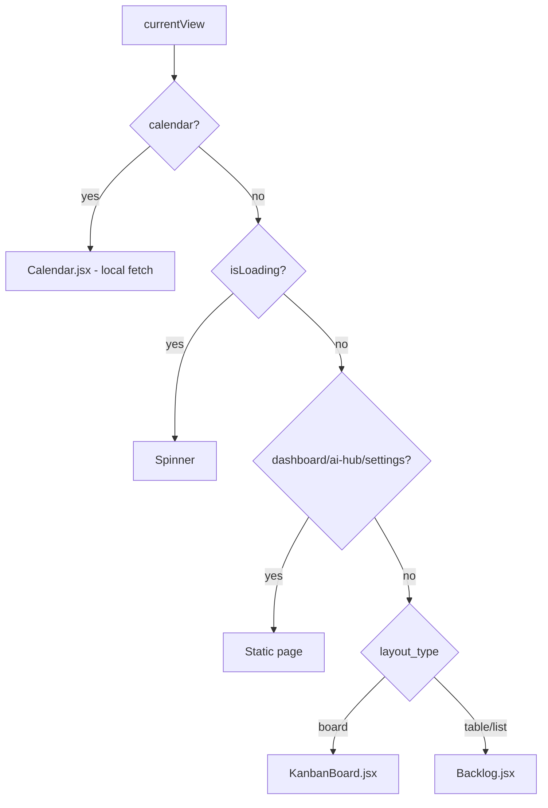

# InTheFlow — Frontend

> **Type**: Reference (live code truth)  
> **Root**: `frontend/src/`  
> **Last Updated**: 2026-05-25

## Page Map

| Page | File | `currentView` | Data source |
| ---- | ---- | ------------- | ----------- |
| Dashboard | `pages/Dashboard.jsx` | `dashboard` | `App.tasks`, `App.projects` |
| AI Flow Hub | `pages/AiHub.jsx` | `ai-hub` | AI endpoints on demand |
| Calendar | `pages/Calendar.jsx` | `calendar` | Local `api.dailyTasks.list()` |
| Kanban Board | `pages/KanbanBoard.jsx` | view UUID | `api.views.execute()` + `api.tasks.list()` |
| Backlog / Table | `pages/Backlog.jsx` | view UUID | `api.views.execute()` |
| Settings | `pages/Settings.jsx` | `settings` | `api.settings.get/update` |

## Components

| Component | File | Role |
| --------- | ---- | ---- |
| Sidebar | `components/Sidebar.jsx` | Navigation, sync, refresh |
| TaskModal | `components/TaskModal.jsx` | Create/edit task, scheduled blocks, AI enhance |
| ViewControlBar | `components/ViewControlBar.jsx` | Filter/sort/group controls for dynamic views |
| Toast | `components/Toast.jsx` | Transient error messages (Calendar) |

## App.jsx State

Central orchestration in `frontend/src/App.jsx`:

| State | Type | Purpose |
| ----- | ---- | ------- |
| `currentView` | string | Active page or view UUID |
| `tasks` | Task[] | Dashboard, settings, and **dynamic views** (drag-drop fallback, Settings grouping list) |
| `projects` | Project[] | Project list for modals and calendar |
| `views` | ViewMeta[] | Sidebar workspace view list |
| `groupingColors` | Record<string, string> | Resolved grouping → hex map |
| `theme` | `'light'` \| `'dark'` | Active theme mode |
| `activeViewData` | object | Current dynamic view metadata |
| `activeViewResult` | object | Query engine execution result |
| `isLoading` | bool | Global loading gate (except calendar) |
| `isSyncing` | bool | Weekly plan sync in progress |
| `activeEditTask` | Task \| null | TaskModal payload |
| `isModalOpen` | bool | TaskModal visibility |
| `dailyTasksVersion` | number | Increment to refetch calendar |
| `calendarAnchorDate` | string \| null | ISO date for calendar week anchor |
| `showCreateViewModal` | bool | Custom view creation dialog |
| `planningSyncEnabled` | bool | Whether sidebar sync button is visible (from `planning_sync_enabled` setting) |

### Key handlers

| Handler | Behavior |
| ------- | -------- |
| `refreshData()` | Reloads views, projects; on dynamic views runs `api.views.execute()` **and** `api.tasks.list()` |
| `handleSyncPlanning()` | `api.settings.syncPlanning()` + alert summary |
| `handleEditTask(task)` | Opens TaskModal |
| `handleNavigateToCalendar(date)` | Sets anchor, switches to calendar, closes modal |
| `handleThemeChange(mode)` | `applyTheme()` + auto-save to API |
| `incrementDailyTasksVersion()` | Bumps counter for calendar refetch |

### View rendering logic

Calendar bypasses the global `isLoading` spinner — it manages its own loading state.

## Sidebar Navigation

`frontend/src/components/Sidebar.jsx`

### Nav order (live)

1. Dashboard
2. AI Flow Hub
3. Calendar
4. **WORKSPACE VIEWS** (dynamic, from `api.views.list()`)
5. Settings (bottom)

### Footer actions

| Button | Action |
| ------ | ------ |
| Refresh Data | `onRefresh()` → `refreshData()` |
| Sync Weekly Plan | `onSyncPlanning()` → markdown import |

### View creation

Clicking **+** in workspace section triggers `create-view-modal` pseudo-view, opening inline modal in App.jsx.

## api.js Namespaces

File: `frontend/src/api.js`  
Base: `http://localhost:8000/api`

| Namespace | Methods |
| --------- | ------- |
| `api.tasks` | `list(filters)`, `get(id)`, `create(data)`, `update(id, data)`, `delete(id)` |
| `api.dailyTasks` | `list({ start_date, end_date, task_id })`, `create(data)`, `update(id, data)`, `delete(id)` |
| `api.projects` | `list()`, `create(data)` |
| `api.settings` | `get()`, `update(data)`, `syncPlanning()` |
| `api.ai` | `classify(data)`, `weeklyPlan()`, `flowAnalyzer()`, `enhanceTicket(data)` |
| `api.views` | `list()`, `get(id)`, `create(data)`, `updateConfig(id, data)`, `delete(id)`, `execute(id)` |

## CSS Theme Tokens

File: `frontend/src/index.css`

Theme is applied via `document.documentElement.dataset.theme` (`dark` default, `light` override).

### Core tokens

| Token | Dark (default) | Light |
| ----- | -------------- | ----- |
| `--bg-primary` | `hsl(224, 25%, 10%)` | `#F8FAFC` |
| `--bg-secondary` | `hsl(224, 20%, 15%)` | `#F1F5F9` |
| `--glass-bg` | semi-transparent dark | semi-transparent white |
| `--glass-border` | white 8% alpha | gray border |
| `--input-bg` | dark translucent | `--bg-secondary` |
| `--sidebar-bg` | dark translucent | white translucent |
| `--modal-overlay` | dark 75% | lighter overlay |
| `--modal-surface` | dark panel | white panel |
| `--nav-active-bg` | white 8% | gray tint |
| `--text-primary` | 95% white | dark slate |
| `--text-secondary` | 70% gray | medium slate |
| `--text-muted` | 50% gray | lighter slate |

### Accent tokens

| Token | Purpose |
| ----- | ------- |
| `--accent-purple` | Gradients, duplicate button |
| `--accent-cyan` | Primary actions, active nav |
| `--accent-green` | Success states |
| `--accent-yellow` | On-hold status |
| `--accent-red` | Delete, errors |

Accents are toned down in light mode (lower saturation).

### Utility classes

| Class | Purpose |
| ----- | ------- |
| `.glass-panel` | Frosted card surface |
| `.interactive` | Hover transition |
| `.spinner` | Loading indicator |

## Theme System

Files: `frontend/src/utils/theme.js`, `frontend/index.html`, `frontend/electron.js`

| Step | Behavior |
| ---- | -------- |
| Boot (index.html) | Inline script sets `dataset.theme` from localStorage before React loads |
| Boot (main.jsx) | Calls `applyTheme(cached)` including Electron IPC |
| App mount | Reconciles localStorage vs API `settings.theme` |
| Settings toggle | Immediate apply + auto-save (no Save button needed) |
| Electron IPC | `setBackgroundColor('#0F172A' \| '#F8FAFC')` |

Storage key: `intheflow_theme`

## Grouping Colors Utility

File: `frontend/src/utils/groupingColors.js`

| Export | Purpose |
| ------ | ------- |
| `DEFAULT_GROUPING_COLORS` | 22 curated hex values (AI, Backend, API, Auth, Catalog, InTheFlow, SocialMedia, … General) |
| `resolveGroupingColors(storedJson)` | Merge user overrides from settings |
| `getTaskGrouping(taskOrRecord)` | Normalize `task_grouping` or EAV `TaskGrouping` |
| `getGroupingColor(grouping, map)` | Lookup with hash fallback |
| `getGroupingCardSurfaceStyle(grouping, map)` | Subtle card background + border tint |
| `getGroupingCardChromeStyle(grouping, map)` | Surface tint + **4px left stripe** (Kanban cards) |
| `getDailyBlockAccentColor(dailyTask, projects, map)` | Calendar stripe: grouping → project → status → neutral |
| `deriveGroupingList(tasks)` | Settings editor grouping names |
| `validateGroupingColorMap(map)` | Hex validation before save |

See [06-Weekly-Plan-Calendar.md](06-Weekly-Plan-Calendar.md) for Kanban/calendar color wiring.

## KanbanBoard Highlights

File: `frontend/src/pages/KanbanBoard.jsx`

- Renders from `viewResult.groups` (EAV via QueryEngine), not raw `Task[]`
- **Default Sprint Board:** columns = **Status**; swimlanes = **TaskGrouping** (`subgroup_by`)
- Swimlane headers use grouping colors (4px left accent + tinted background)
- Cards use `getGroupingCardChromeStyle()` — surface tint + 4px left stripe + grouping badge
- Local filters default to **All categories** / **All owners** (tabs above board)
- `STATUS_COLUMNS` defines column header colors when grouped by Status
- Column header tint when primary `group_by === "TaskGrouping"` (custom views)
- Drag-and-drop finds tasks in nested `groups` (not flat `records`); preserves `task_grouping` on update
- Context menu (right-click): edit, duplicate, delete — includes full task shape with grouping

## TaskModal Highlights

File: `frontend/src/components/TaskModal.jsx`

- Two-column layout: details (left) + parameters (right)
- **Scheduled blocks** section (edit mode only): lists linked DailyTasks
- **Add to calendar**: inline form with next 15-min slot defaults
- Row click → `onNavigateToCalendar(block.date)`
- **AI Enhance**: calls `api.ai.enhanceTicket()`
- Duplicate creates new task without id

## Entry Points

| File | Role |
| ---- | ---- |
| `frontend/src/main.jsx` | ReactDOM render, theme boot |
| `frontend/index.html` | Root div, inline theme script |
| `frontend/electron.js` | Electron main process |
| `frontend/preload.js` | IPC bridge |
