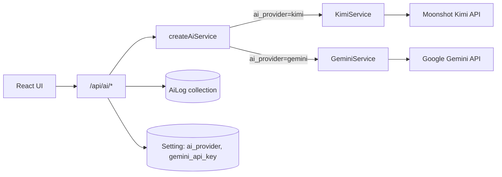

# InTheFlow — AI Capabilities

> **Type**: Reference (live code truth)  
> **Services**: `backend-js/src/ai/KimiService.ts`, `backend-js/src/ai/GeminiService.ts`  
> **Config**: `backend-js/src/ai/aiConfig.ts` — `createAiService()` factory  
> **Router**: `backend-js/src/ai/routes.ts`  
> **Last Updated**: 2026-05-25

## Overview

InTheFlow uses a **multi-provider AI architecture** for task intelligence. The default provider is **Moonshot Kimi**; **Google Gemini** (`gemini-2.0-flash`) is available as an alternative. The active provider is selected via `AI_PROVIDER` env or `ai_provider` setting (default: `kimi`). The backend uses `createAiService()` to instantiate the appropriate service; the frontend calls REST endpoints via `api.ai.*` in `frontend/src/api.js`.



## Configuration

### Provider selection

| Source | Key | Values |
| ------ | --- | ------ |
| Settings DB | `ai_provider` | `kimi` (default), `gemini` |
| Environment | `AI_PROVIDER` | Override setting |

Settings UI: **Settings → AI Provider** selector.

### Kimi key resolution

| Source | Key | Priority |
| ------ | --- | -------- |
| Settings DB | `gemini_api_key` | Primary (legacy UI label — stores Kimi key) |
| Settings DB | `kimi_api_key` | Alternate |
| Environment | `KIMI_API_KEY` / `GEMINI_API_KEY` | Fallback |
| File | `backend-js/.kimi-api-key` | Local dev (gitignored) |

### Gemini key resolution

| Source | Key | Priority |
| ------ | --- | -------- |
| Settings DB | `gemini_api_key` | Primary |
| Environment | `GEMINI_API_KEY` | Fallback |
| File | `backend-js/.gemini-api-key` | Local dev (gitignored) |

### Models

| Provider | Default model | Override env |
| -------- | ------------- | ------------ |
| Kimi | `kimi-k2.6` | `KIMI_MODEL` |
| Gemini | `gemini-2.0-flash` | `GEMINI_MODEL` |

Universal override: `AI_MODEL` env applies to whichever provider is active.

Response format: JSON (both providers).

### Stub mode

When no API key is configured (`isConfigured = false`), each endpoint returns deterministic stub data with **HTTP 200** (not 503). Stubs allow offline development and match golden parity tests.

## API Endpoints

Paths match `frontend/src/api.js` — `api.ai.*`. See [03-Backend-API.md](03-Backend-API.md#ai-apiai) for request/response schemas.

| Endpoint | `api.js` method | UI consumer | AiLog action |
| -------- | --------------- | ----------- | ------------ |
| POST `/api/ai/classify` | `api.ai.classify()` | Task creation flows (future/manual) | `classify_task` |
| POST `/api/ai/weekly-plan` | `api.ai.weeklyPlan()` | AiHub → Compile Sprint Plan | `weekly_plan_compilation` |
| POST `/api/ai/flow-analyzer` | `api.ai.flowAnalyzer()` | Dashboard (on load), AiHub | `flow_blocker_diagnosis` |
| POST `/api/ai/enhance-ticket` | `api.ai.enhanceTicket()` | TaskModal → AI Enhance button | `ticket_description_enhancement` |

All successful calls write an `AiLog` entry (tokens_used populated when live Kimi responds).

## KimiService Methods

### classify_task(name, description, project_names)

**Purpose**: Auto-categorize a new task.

**Output schema**:

```json
{
  "category": "business|dev",
  "project_name": "Sample Project",
  "estimated_duration": 60,
  "confidence": 0.9,
  "rationale": "..."
}
```

Router maps `project_name` back to `project_id` when a match exists.

**Stub**: Keyword heuristic (`code`, `test`, `api` → dev; else business).

### compile_weekly_plan(planning_contents)

**Purpose**: Summarize markdown planning files into structured priorities.

**Input**: Concatenated markdown from planning folder (see context loading below).

**Output schema**:

```json
{
  "week_summary": "...",
  "priorities": [{ "name", "category", "project" }],
  "suggested_calendar": [{ "day": "Monday", "tasks": ["..."] }]
}
```

**Stub**: Generic placeholder summary with one dev priority.

**Note**: This is **advisory only** — does not write to database. Distinct from **Sync Weekly Plan** (deterministic markdown parser).

### diagnose_flow(tasks)

**Purpose**: Identify flow blockers from active task metrics.

**Input**: Array of `{ name, status, category, estimated_duration, current_duration }` for all non-done tasks.

**Output schema**:

```json
{
  "friction_score": 0-100,
  "identified_blockers": [{ "task_name", "blocker_type", "description" }],
  "remediation_actions": ["..."],
  "split_recommendations": [{ "original_task", "sub_tasks": [] }]
}
```

Blocker types: `estimation_exceeded`, `on_hold`, `unclear_spec`

**Stub**: Scans for on_hold and overdue tasks; generates split recommendations for overdue.

### enhance_ticket(name, description_stub, context)

**Purpose**: Generate professional markdown ticket description.

**Output schema**:

```json
{ "enhanced_description_markdown": "### Description\n..." }
```

Context loaded from planning files whose names contain `mvp`, `week`, or `planning`.

**Stub**: Template with Description, Requirements, Preconditions, Verification sections.

### parse_weekly_plan_ai(planning_contents)

**Purpose**: AI fallback parser for weekly plan sync (not exposed as REST endpoint).

**Called by**: `syncService.syncWeeklyPlan()` when regex parser returns zero tasks. Uses the active AI provider's `parseWeeklyPlanAi()` method.

**Output schema**:

```json
{
  "tasks": [{
    "name": "...",
    "description": "Owner: Alice | ...",
    "status": "backlog|in_progress|done",
    "category": "dev|business",
    "owner": "Alice|Bob|Shared"
  }]
}
```

**Stub**: Empty task list.

## Weekly Plan Sync (Markdown Import)

File: `backend-js/src/settings/syncPlanning/syncService.ts`  
Trigger: Sidebar **Sync Weekly Plan** → POST `/api/settings/sync-planning`

This is **separate from** the AI weekly-plan compiler — it deterministically imports tasks into the database.

### File discovery

| Step | Logic |
| ---- | ----- |
| Directory | `""` (user-configurable `PLANNING_DIR`) |
| Active file | Latest alphabetically among `Current_Planning_*.md` |
| Dedup | SHA-256 hash stored in `sync_active_file_hash` setting |

### Regex parser (`parse_weekly_plan`)

Parses checklist lines under `### Week:` section:

```
- [ ] Ⓑ **Task Name**: description
```

| Marker | Mapping |
| ------ | ------- |
| `[ ]` | status `backlog` |
| `[/]` | status `in_progress` |
| `[x]` / `[X]` | status `done` |
| Ⓑ | owner `Alice` |
| 🅾️ | owner `Bob` |
| 🤝 | owner `Shared` |
| `#### 💻 Development` header | category `dev` |
| Other `####` headers | category `business` |

### AI fallback

If regex yields 0 tasks, invokes Kimi AI fallback parser. Sets `parser_mode: "ai"` in response.

### Upsert logic

| Condition | Action |
| --------- | ------ |
| Task exists (name + source=`planning`) | Update description, status, category, owner, grouping |
| New task | Create with source=`planning`, project=Sample Project |
| Done planning task not in current file | Auto-archive |

### Task grouping inference (`guess_task_grouping`)

Keyword heuristics map task text to grouping names (AI, Backend, SocialMedia, etc.).

### Sync response

```json
{
  "status": "success|skipped",
  "file_parsed": "Current_Planning_....md",
  "parser_mode": "regex|ai|skipped",
  "tasks_created": 0,
  "tasks_updated": 0,
  "tasks_archived": 0,
  "total_parsed": 0
}
```

Frontend displays alert with file name, parser mode, and counts.

## Planning Context Loading (AI endpoints)

| Endpoint | Path source | File filter |
| -------- | ----------- | ----------- |
| `/api/ai/weekly-plan` | `planning_folder_path` setting or default Planning dir | All `*.md`, skip paths containing `archive` |
| `/api/ai/enhance-ticket` | Same | Files with `mvp`, `week`, or `planning` in name |

## Frontend Integration Points

| Feature | File | AI call |
| ------- | ---- | ------- |
| Dashboard friction widget | `pages/Dashboard.jsx` | `api.ai.flowAnalyzer()` on task load |
| AI Hub compiler | `pages/AiHub.jsx` | `api.ai.weeklyPlan()` |
| AI Hub diagnostics | `pages/AiHub.jsx` | `api.ai.flowAnalyzer()` |
| TaskModal enhance | `components/TaskModal.jsx` | `api.ai.enhanceTicket()` |
| Weekly sync | `App.jsx` via Sidebar | `api.settings.syncPlanning()` (not direct AI) |

## Audit Logs

AI logs are stored in the MongoDB `ai_logs` collection.

Each log captures: action name, prompt summary, response string, token count, model used, timestamp.
