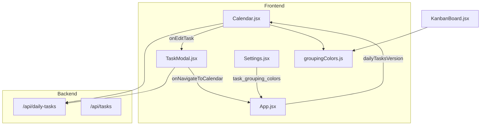

# InTheFlow — Weekly Plan Calendar

> **Type**: Reference (live code truth)  
> **Feature**: Weekly Plan Calendar  
> **Last Updated**: 2026-05-25

## Feature Summary

The Weekly Plan Calendar adds **time-blocked daily scheduling** to InTheFlow, distinct from sprint Task tickets on the Kanban board. Users schedule work on a Mon–Sun grid, optionally linking blocks to parent tasks, with bidirectional navigation between Calendar and TaskModal.

Companion features shipped in the same initiative:

- **Kanban grouping colors** — 4px left stripe on cards, shared accent logic with calendar
- **Light/dark theme** — CSS token system with Settings toggle and Electron background sync

## Architecture



## DailyTask Entity

See [02-Database.md](02-Database.md#dailytask) for schema.

| Concept | Implementation |
| ------- | -------------- |
| Standalone block | `task_id = null`, optional `title` |
| Linked block | `task_id` → parent Task; inherits name/grouping for display |
| Display title | `title ?? parent_task_name ?? "Untitled block"` |
| Archived parent | Opacity 0.7, `(archived)` suffix on label |

### Materialized parent fields (backend-js)

API responses include `parent_task_name`, `parent_task_grouping`, `parent_project_id`, `parent_status`, and `parent_archived`. In Python these come from a SQL LEFT JOIN at read time. In **backend-js**, fields are stored on the DailyTask projection and updated via Emmett `handle()` when the parent task changes (`taskSideEffects.syncDailyTaskParentFields` in `backend-js/src/integration/taskSideEffects.ts`).

## Calendar Grid UX

File: `frontend/src/pages/Calendar.jsx`

### Grid parameters

| Constant | Value |
| -------- | ----- |
| `SLOT_MINUTES` | 15 |
| Visible hours | 07:00 – 22:00 |
| `SLOT_HEIGHT` | 20px per slot |
| Week start | ISO Monday |

### Interactions

| Action | Behavior |
| ------ | -------- |
| Click-drag empty slot | Create preview → BlockModal on release |
| Drag block body | Move to new day/time (duration preserved) |
| Drag top/bottom edge | Resize start or end independently |
| Single click linked block | Fetch full task → open TaskModal |
| Single click unlinked block | Open BlockModal in edit mode |
| Right-click / Delete key | Confirm delete block |
| Prev/Next week | Shift 7 days, refetch range |
| Today button | Reset to current ISO week |
| Create block (header) | Modal with today 09:00–10:00 defaults |

### Overlap layout

`assignOverlapColumns()` computes side-by-side columns for overlapping blocks on the same day.

### Accent stripe color

`getDailyBlockAccentColor()` priority:

1. Parent `task_grouping` → grouping colors map
2. Parent `project_id` → project color
3. Parent `status` → `STATUS_COLOR_MAP`
4. Neutral `#64748B`

### Data fetching

Calendar owns its fetch — does not use `App.tasks`:

```javascript
api.dailyTasks.list({ start_date: monday, end_date: sunday })
```

Refetch triggers: `weekStartDate` change, `dailyTasksVersion` increment.

### Error recovery

Failed PATCH after drag/resize reverts block to snapshot position and shows Toast.

## TaskModal Linking

File: `frontend/src/components/TaskModal.jsx`

Available in **edit mode only** (task must have `id`).

| Feature | API | Navigation |
| ------- | --- | ---------- |
| Scheduled blocks list | `GET /api/daily-tasks?task_id=` | Row click → calendar week containing date |
| Add to calendar | `POST /api/daily-tasks` | Optional "Open in Calendar" after save |
| Delete block | `DELETE /api/daily-tasks/{id}` | Increments `dailyTasksVersion` |

Add form defaults: next 15-min slot from current time, 1-hour duration.

App wiring (`App.jsx`):

- `handleNavigateToCalendar(date)` — sets `calendarAnchorDate`, `currentView = 'calendar'`
- `onDailyTasksChange={incrementDailyTasksVersion}` on TaskModal and Calendar

## Grouping Colors

Files: `frontend/src/utils/groupingColors.js`, `frontend/src/pages/Settings.jsx`, `frontend/src/pages/KanbanBoard.jsx`

### Defaults

12 curated colors in `DEFAULT_GROUPING_COLORS` (AI, Backend, General, etc.).

### User overrides

Settings → **Task Grouping Colors** editor:

- Persists to `task_grouping_colors` setting (JSON map)
- Validates `#RRGGBB` hex before save
- Unknown groupings get deterministic hash color from `OVERFLOW_PALETTE`

### Kanban integration

- **Sprint Board layout:** Status columns + **TaskGrouping swimlanes** (backend-js seed)
- Card chrome: `getGroupingCardChromeStyle()` — surface tint + **4px left stripe** + grouping badge on each card
- Swimlane headers: grouping-colored left accent when `subgroup_by === "TaskGrouping"`
- When primary `group_by === "TaskGrouping"`: column headers tinted with grouping color
- Status grouping: column headers use `STATUS_COLUMNS` colors
- Local filters: category and owner tabs (default **All** / **All owners**)

### Reseed / EAV maintenance

After wiping Mongo task streams, also clear or backfill `database_records`:

```powershell
cd backend-js
pnpm backfill:task-records
```

Weekly plan CLI: `python .cursor/skills/weekly-planning-assistant/seeds/seed_may26_clean.py` (creates tasks, daily blocks, runs backfill).

## Theme Toggle

Files: `frontend/src/utils/theme.js`, `frontend/src/pages/Settings.jsx`, `frontend/src/index.css`

| Control | Location |
| ------- | -------- |
| Appearance segmented control | Settings → Dark \| Light |
| Auto-save | Immediate apply + POST `settings.theme` |
| Boot flash prevention | Inline script in `index.html` |
| Electron sync | IPC `setBackgroundColor` |

Theme applies to: shell, Calendar, TaskModal, Settings, Sidebar. See [07-Known-Limitations.md](07-Known-Limitations.md) for partial coverage elsewhere.

## Success Criteria Mapping

Reference: Feature success criteria documentation.

| SC # | Criterion | Live implementation |
| ---- | --------- | ------------------- |
| 1 | Sidebar Calendar opens ISO week | `Sidebar.jsx` → `currentView='calendar'` → `computeWeekStart()` |
| 2 | Week navigation | `navigateWeek(±1)` in Calendar.jsx |
| 3 | Date-range GET returns blocks | `daily_tasks.py` / `backend-js/src/dailyTask/` |
| 4 | Invalid GET returns 4xx | 400 when params missing |
| 5 | Drag-create block | `handlePointerDownEmpty` → BlockModal → POST |
| 6 | Top resize PATCH start_time only | `resize-top` drag path |
| 7 | Move PATCH preserves duration | `move` drag path |
| 8 | TaskModal Add to calendar | `handleSaveAddForm` |
| 9 | Row click navigates to week | `handleBlockRowClick` → `calendarAnchorDate` |
| 10 | Linked block opens TaskModal | `handleBlockClick` → `api.tasks.get` |
| 11 | Task delete cascades daily tasks | `tasks.py` / `taskSideEffects.onTaskDeleted` |
| 12 | Failed PATCH reverts + toast | `persistBlockUpdate` |
| 13 | 422 on invalid schedule | `validate_schedule()` |
| 14 | Untitled + neutral accent | `getBlockTitle`, `getDailyBlockAccentColor` |
| 15 | Archived parent styling | opacity 0.7, suffix |
| 16 | Overlap columns | `assignOverlapColumns()` |
| 17 | Kanban grouping stripe | `getGroupingCardChromeStyle` + TaskGrouping swimlanes |
| 18 | Light theme toggle | Settings Appearance + `applyTheme()` |

## Implementation Drifts (resolved / documented)

Reference: Drift validation implementation plan.

| Drift | Live behavior |
| ----- | ------------- |
| Sidebar order | Dashboard → AI Hub → Calendar (not between Dashboard and views) |
| Header create default | Fixed 09:00–10:00, not scroll position |
| Today button | Added (not in original plan) |
| `parent_archived` field | Added to API response |
| Settings Appearance | **Implemented** (was missing at drift validation time) |
| Sprint Board subgroups | **Added** — `subgroup_by: TaskGrouping` in backend-js seed + startup patch |

## Out of Scope (v1)

From success criteria section 5:

- OS/system theme sync
- Full-app hardcoded color cleanup
- DailyTask description/notes columns
- User-configurable grid hours (fixed 07:00–22:00)
- Overnight multi-day blocks
- AI auto-populate calendar from weekly plan compiler

## Key Source Files

| Area | Path |
| ---- | ---- |
| DailyTask model | `backend/database.py` (Python) / `backend-js/src/dailyTask/` (Emmett) |
| Daily tasks API | `backend/routers/daily_tasks.py` / `backend-js/src/dailyTask/api/routes.ts` |
| Parent field sync | - / `backend-js/src/integration/taskSideEffects.ts` |
| Task cascade delete | `backend/routers/tasks.py` / `taskSideEffects.onTaskDeleted` |
| Calendar page | `frontend/src/pages/Calendar.jsx` |
| TaskModal linking | `frontend/src/components/TaskModal.jsx` |
| App orchestration | `frontend/src/App.jsx` |
| Grouping colors | `frontend/src/utils/groupingColors.js` |
| Theme | `frontend/src/utils/theme.js` |
| View seed / patch | `backend-js/src/views/seed/registerViewsSeed.ts` |
| Settings UI | `frontend/src/pages/Settings.jsx` |
| EAV backfill script | `backend-js/scripts/backfill-task-records.ts` |
