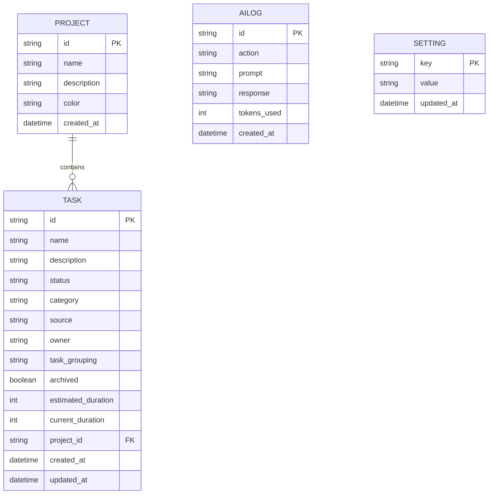

# InTheFlow: Database Schema Specification

This document outlines the SQLite relational database schema and indices designed for **InTheFlow**. The backend utilizes **SQLModel** (a combination of SQLAlchemy and Pydantic) to model and validate data.

The SQLite database file `intheflow.db` is located in the `backend/` root directory.

---

## 1. SQLModel Definitions

### A. Project Model
Represents groupings of related tasks (e.g. "Sample Project", "StoryWeaver").
```python
from datetime import datetime
from typing import List, Optional
from sqlmodel import Field, Relationship, SQLModel
import uuid

class Project(SQLModel, table=True):
    id: str = Field(default_missing=None, primary_key=True)
    name: str = Field(index=True, unique=True)
    description: Optional[str] = Field(default=None)
    color: str = Field(default="#3B82F6") # Hex code default (blue)
    created_at: datetime = Field(default_factory=datetime.utcnow)

    # Relationships
    tasks: List["Task"] = Relationship(back_populates="project")
```

### B. Task Model
Represents tickets/tasks, supporting business and technical divisions, NotionArch metrics, and time tracking.
```python
class Task(SQLModel, table=True):
    id: str = Field(default_factory=lambda: str(uuid.uuid4()), primary_key=True)
    name: str = Field(index=True)
    description: Optional[str] = Field(default=None)
    status: str = Field(default="backlog", index=True) # backlog, ready_to_start, in_progress, on_hold, done
    category: str = Field(default="business", index=True) # business, dev
    source: str = Field(default="user_created") # notion_arch, planning
    owner: Optional[str] = Field(default="Alice", index=True)
    task_grouping: Optional[str] = Field(default="General", index=True)
    archived: bool = Field(default=False, index=True)
    
    # Time Tracking
    estimated_duration: Optional[int] = Field(default=None) # In minutes
    current_duration: Optional[int] = Field(default=0) # In minutes
    
    # Foreign Keys
    project_id: Optional[str] = Field(default=None, foreign_key="project.id", index=True)
    
    # Timestamps
    created_at: datetime = Field(default_factory=datetime.utcnow)
    updated_at: datetime = Field(default_factory=datetime.utcnow)

    # Relationships
    project: Optional[Project] = Relationship(back_populates="tasks")
```

### C. AI Audit Log Model
Keeps track of LLM calls, costs, and actions executed via `gemini-3.1-flash-lite`.
```python
class AiLog(SQLModel, table=True):
    id: str = Field(default_factory=lambda: str(uuid.uuid4()), primary_key=True)
    action: str = Field(index=True) # e.g. "classify_task", "weekly_plan_summary", "blocker_check"
    prompt: str = Field(default="")
    response: str = Field(default="")
    tokens_used: int = Field(default=0)
    created_at: datetime = Field(default_factory=datetime.utcnow)
```

### D. Settings Model
Persists key-value settings for the application (such as API keys, workspace pathing).
```python
class Setting(SQLModel, table=True):
    key: str = Field(primary_key=True) # e.g., "gemini_api_key", "planning_folder_path"
    value: str
    updated_at: datetime = Field(default_factory=datetime.utcnow)
```

---

## 2. Relationships & Entity-Relationship (ER) Diagram



---

## 3. Database Initialisation & SQLite Settings

Upon backend startup, the engine is initialized with Write-Ahead Logging (WAL) enabled to allow safe concurrent reads and writes from the Electron dashboard:

```python
from sqlmodel import create_engine, SQLModel

sqlite_file_name = "intheflow.db"
sqlite_url = f"sqlite:///{sqlite_file_name}"

# Enable WAL mode for concurrency and check_same_thread disable
connect_args = {"check_same_thread": False}
engine = create_engine(sqlite_url, connect_args=connect_args)

def create_db_and_tables():
    SQLModel.metadata.create_all(engine)
    # Set WAL Mode
    with engine.connect() as connection:
        connection.exec_commit("PRAGMA journal_mode=WAL;")
```
