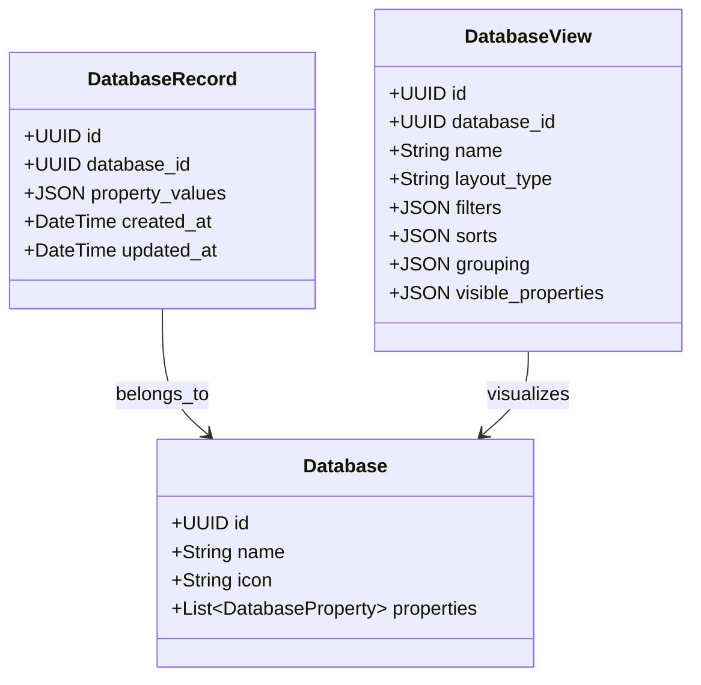

# 07-Enhanced-Notion-DB-Spec.md: Notion-Like DB Engine Specification

This specification outlines the architecture for **InTheFlow DB Engine (v2.0)**, upgrading the application from a rigid, hardcoded tasks tracker to a dynamic, multi-view relational database engine. It incorporates advanced capabilities inspired by Notion databases, adapted for a local desktop environment running SQLite and React.

---

## 1. Architectural Concept: EAV-JSON Hybrid Model

To allow users to create databases, define custom fields (properties), and establish relations without executing complex SQL `ALTER TABLE` schemas, InTheFlow v2 uses an **Entity-Attribute-Value (EAV) hybrid model** leveraging SQLite's native JSON capabilities.



### SQLite Schema Definition
```sql
CREATE TABLE database (
    id TEXT PRIMARY KEY,
    name TEXT NOT NULL,
    icon TEXT,
    properties TEXT NOT NULL -- JSON array defining typed columns
);

CREATE TABLE database_record (
    id TEXT PRIMARY KEY,
    database_id TEXT NOT NULL,
    property_values TEXT NOT NULL, -- JSON object containing cell values
    created_at TIMESTAMP DEFAULT CURRENT_TIMESTAMP,
    updated_at TIMESTAMP DEFAULT CURRENT_TIMESTAMP,
    FOREIGN KEY(database_id) REFERENCES database(id) ON DELETE CASCADE
);

CREATE TABLE database_view (
    id TEXT PRIMARY KEY,
    database_id TEXT NOT NULL,
    name TEXT NOT NULL,
    layout_type TEXT NOT NULL, -- 'table', 'board', 'list', 'calendar', 'timeline'
    filters TEXT NOT NULL,      -- JSON AST representing nested filters
    sorts TEXT NOT NULL,        -- JSON array of sorting priority
    grouping TEXT NOT NULL,     -- JSON specifying primary/subgroup keys
    visible_properties TEXT NOT NULL, -- JSON array of visible property keys
    FOREIGN KEY(database_id) REFERENCES database(id) ON DELETE CASCADE
);
```

---

## 2. Advanced DB Capabilities

### 2.1 Multi-View Query Engine
Each view is a query configuration. When a view is loaded in the frontend:
1. The client requests the view parameters from `/api/views/{view_id}`.
2. The backend constructs a dynamic SQL query targeting `database_record` records.
3. The server filters, sorts, and groups the JSON data using SQLite JSON extraction functions (`json_extract` / `->>`), returning the structured dataset.

### 2.2 Nested AST Filtering
InTheFlow v2 supports multi-layered filter nesting (AND/OR groups up to 3 layers deep) represented as an Abstract Syntax Tree (AST):

```json
{
  "operator": "or",
  "rules": [
    {
      "property": "Priority",
      "condition": "equals",
      "value": "high"
    },
    {
      "operator": "and",
      "rules": [
        {
          "property": "Status",
          "condition": "equals",
          "value": "in_progress"
        },
        {
          "property": "Owner",
          "condition": "contains",
          "value": "Alice"
        }
      ]
    }
  ]
}
```

The Python backend translates this AST directly into SQLite JSON conditions:
```sql
SELECT * FROM database_record 
WHERE database_id = :db_id 
  AND (
    json_extract(property_values, '$.Priority') = 'high'
    OR (
      json_extract(property_values, '$.Status') = 'in_progress'
      AND json_extract(property_values, '$.Owner') LIKE '%Alice%'
    )
  );
```

### 2.3 Grouping & Subgrouping (Kanban Swimlanes)
Views can group items into logical dimensions:
* **Primary Grouping**: Columns in the Kanban board or sections in Table/List views (e.g. Group by `Status`).
* **Sub-grouping (Swimlanes)**: Collapsible horizontal rows within the board (e.g. Subgroup by `Owner` or `Priority`).

```
+-------------------------------------------------------------------+
|               | Backlog          | In Progress    | Done          |
+---------------+------------------+----------------+---------------+
| Alice (Ⓐ)     | [Task 1]         | [Task 2]       | [Task 3]      |
|               | [Task 4]         |                |               |
+---------------+------------------+----------------+---------------+
| Bob (🅾️)      |                  | [Task 5]       | [Task 6]      |
+---------------+------------------+----------------+---------------+
```

---

## 3. Advanced Relational Capabilities

```
  [Tasks Database]                     [Projects Database]
+-------------------+                +-------------------+
| Name: Task A      |                | Name: InTheFlow   |
| Project (Relation)+===============>| Lead: Alice       |
| Lead (Rollup)     |                | Status: Active    |
+-------------------+                +-------------------+
```

### 3.1 Relations
Links records from Database A to Database B. It is modeled as a list of strings containing referenced record IDs in the JSON values:
* In `database_record` for Task A:
  `property_values: { "project_relation": ["project_rec_uuid_789"] }`

### 3.2 Rollups
Pulls property values from related records and calculates statistics.
* **Configuration**: Specifying the Relation property to follow, the target property to retrieve, and the aggregation function.
* **Supported Aggregations**:
  * `show_original`: Returns the list of raw values.
  * `count_all` / `count_empty`: Count metrics.
  * `percent_checked`: Percentage of checkboxes marked true.
  * `sum` / `average` / `min` / `max`: Numerical aggregates.

### 3.3 Formulas (Notion Formula 2.0 Style)
Computed columns calculated dynamically in memory:
* **Syntax**: Standard Javascript-like expressions with property tokens (e.g. `prop("Estimated Duration") - prop("Current Duration")` or `if(prop("Status") == "done", "✅ Done", "⏳ Pending")`).
* **Evaluation Pipeline**:
  ```
  [JSON Property Values] ---> [Formula Parser (AST)] ---> [Sandbox Evaluator] ---> [Computed View Cells]
  ```
  To prevent execution of arbitrary code, the Python backend runs a highly sandboxed expression interpreter (e.g. python `asteval` or a custom grammar evaluator in TypeScript on the client).

---

## 4. UI/UX Specifications for Database View Control

A premium UI layout is vital to maintain the glassmorphic aesthetics.

### 4.1 View Tabs & Configuration Bar
* **Tabs Header**: Allows toggling views (e.g., `📋 Sprint Board`, `📅 Calendar View`, `📊 Project Table`).
* **Settings Bar**: Row of buttons displaying filters and groupings currently active (e.g. `Filter (2) · Sort (1) · Group: Status · Subgroup: Owner`).

### 4.2 Dynamic Logic Builder (Filter Popover)
Clicking the "Filter" button displays a glassmorphic popover panel:
* Add filter conditions.
* Dropdowns choose property name, comparison operator (equals, contains, starts_with, is_empty, greater_than), and value input.
* Grouping controls to add nested `AND`/`OR` rules.

### 4.3 Grouping Controller
Selects:
1. **Group By**: Select property (Select, Multi-select, Status, or Owner).
2. **Sort Groups**: Alphabetical, manual drag-order, or hide empty columns.
3. **Subgroup By**: Select subgrouping property to display horizontal swimlanes.
